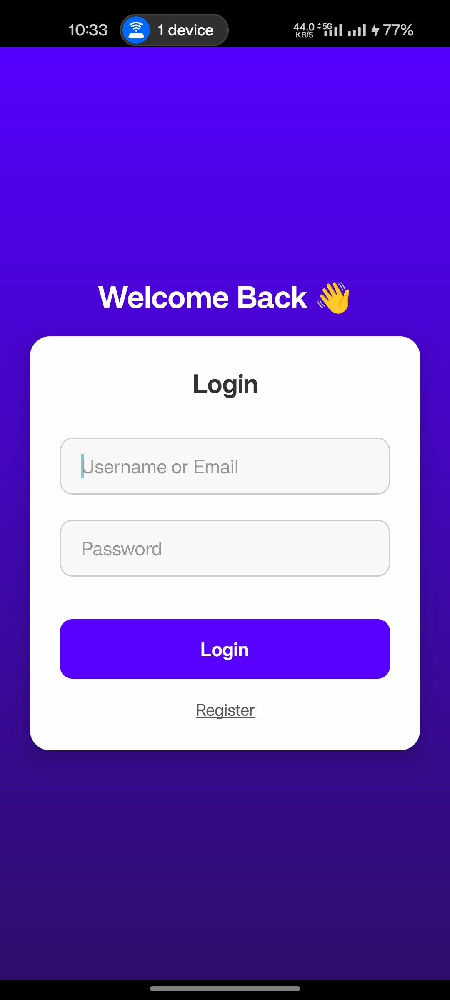
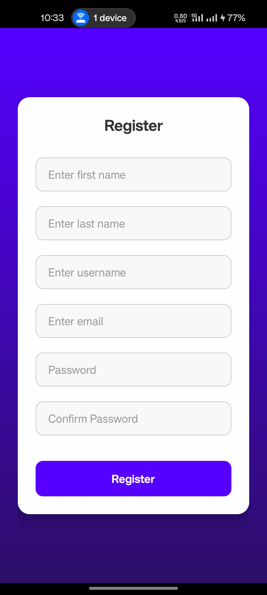
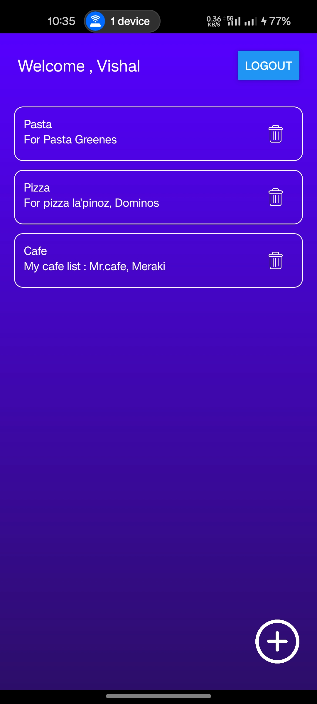
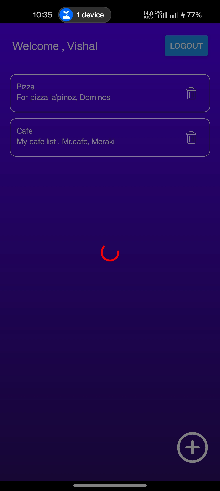
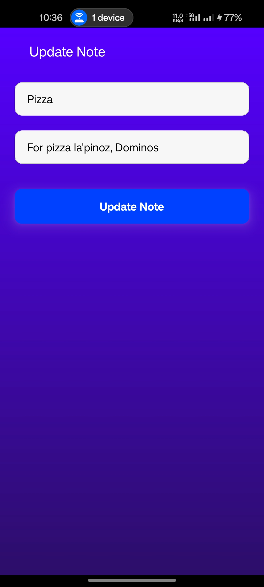

# 📓 React Native Notes App

A simple and clean Notes App built with **React Native** and **TypeScript**.

---

## ✨ Features

- 📌 User Authentication (Login & Register)
- 📝 Add and List Notes
- 🔒 Secure API services integration
- 🎨 Reusable Input Components
- 🛠️ Type-safe Navigation
- 🚀 Clean, scalable folder structure

---

## 🌐 Screenshots

| Login                        | Register                        | Note List                        | Note Loading                         |
| ---------------------------- | ------------------------------- | -------------------------------- | ------------------------------------ |
|  |  |  |  |

| Add Note                        | Update Note                        |
| ------------------------------- | ---------------------------------- |
|  |  |

---

## 🏗️ Project Structure

```
app.tsx

app/
├── Auth/
│   ├── LoginScreen.tsx
│   └── Register.tsx
│
├── Components/
│   └── InputField.tsx
│
├── Home/
│   ├── NoteAddScreen.tsx
│   └── NoteListScreen.tsx
│
├── models/
│   ├── errorModel.ts
│   ├── note.ts
│   └── user.ts
│
├── Navigation/
│   └── types.ts
│
└── services/
    ├── api.ts
    ├── auth.ts
    └── notes.ts
```

---

## 🚀 Getting Started

### Prerequisites

- Node.js
- npm or yarn
- React Native CLI or Expo CLI
- Android Studio / Xcode (for emulators)

---

### Installation

1. **Clone the repository**

   ```bash
   git clone https://github.com/your-username/notes-app.git
   cd notes-app
   ```

2. **Install dependencies**

   ```bash
   npm install
   # or
   yarn install
   ```

3. **Start the Metro server**

   ```bash
   npm run start
   # or
   yarn start
   ```

4. **Run the App**
   ```bash
   npm run android
   # or
   npm run ios
   ```

---

## 🛠️ Technologies Used

- React Native
- TypeScript
- Axios (for API calls)
- React Navigation

---

## 📂 Important Files

- `app.tsx` — App entry point
- `app/Auth/` — Screens for login and registration
- `app/Home/` — Screens to add and list notes
- `app/Components/InputField.tsx` — Reusable input component
- `app/models/` — Type models (User, Note, Error)
- `app/services/` — API services for authentication and notes
- `app/Navigation/types.ts` — Type definitions for navigation

---

## 📜 License

This project is licensed under the MIT License.

---

## 🙌 Acknowledgements

- React Native Official Docs
- React Navigation
- Axios Documentation
